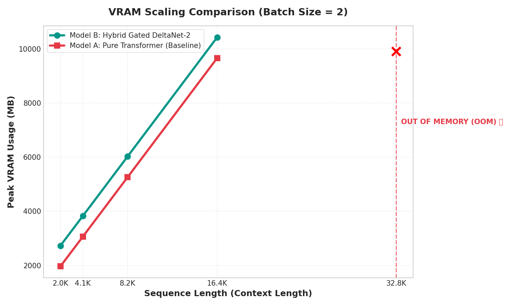
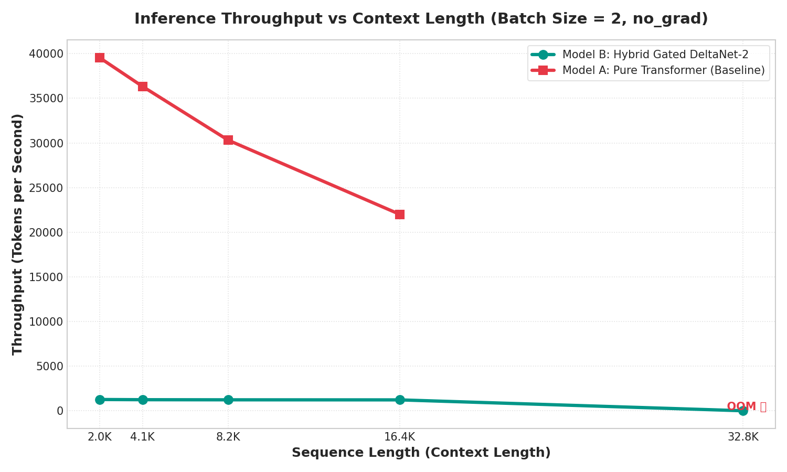
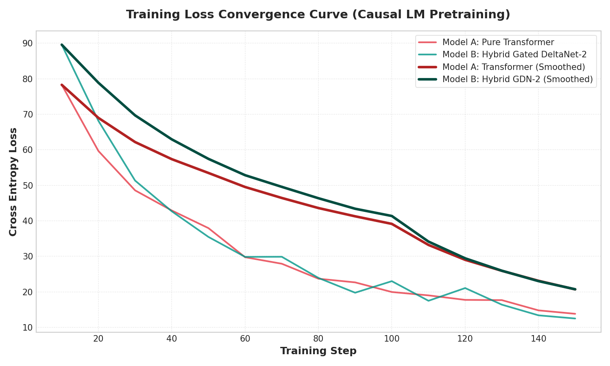

# GATE2: Pure Transformer vs Hybrid Gated DeltaNet-2 (GDN-2) Benchmark

A project to benchmark and compare a **Pure Transformer (Model A)** and a **Hybrid Gated DeltaNet-2 (Model B)** under a "Fair Play" parameter-matched setup (~100M parameters) using context length scaling (2K to 8K) and next-token prediction pretraining on Thai old books dataset.

## Project Structure
```
GATE/
├── models/
│   ├── transformer.py          # Pure Transformer (Baseline)
│   ├── gated_deltanet2.py      # Hybrid Gated DeltaNet-2
│   └── model_utils.py          # Parameter matching and helper utilities
├── utils/
│   ├── trainer.py              # Next-token prediction pretraining loop
│   └── benchmark.py            # VRAM & Speed throughput metrics logger
├── train.py                    # Pretraining script (Thai old books dataset)
├── download_dataset.py         # Dynamic dataset & tokenizer caching script
├── benchmark_vram.py           # VRAM scaling benchmark script
├── benchmark_speed.py          # Speed (tokens/sec) scaling benchmark script
├── plot_results.py             # Generates comparison charts
├── requirements.txt            # Package dependencies
└── experiment.ipynb            # Kaggle/Colab pipeline notebook
```

## Setup Instructions

### 1. Install Dependencies
```bash
pip install -r requirements.txt
```

### 2. Download Tokenizer and Dataset
The pretraining script uses the **Typhoon-7b Tokenizer** and the **pythainlp/thai-tnhc2-books** dataset. You can fetch and cache them locally using:
```bash
python download_dataset.py
```

### 3. Run VRAM & Speed Benchmarks
To run memory and speed benchmarks across different context lengths:
```bash
# Benchmark VRAM
python benchmark_vram.py --model transformer --device cuda:0
python benchmark_vram.py --model hybrid --device cuda:0

# Benchmark Speed
python benchmark_speed.py --model transformer --device cuda:0
python benchmark_speed.py --model hybrid --device cuda:0
```

*Note: On dual-GPU environments (like Kaggle T4 x2), you can run them concurrently by specifying different devices (`cuda:0` and `cuda:1`) in parallel.*

### 4. Plot Comparison Results
```bash
python plot_results.py
```
This saves comparison charts in the `results/` folder.

## Benchmark Results

Here are the results comparing **Model A (Pure Transformer)** and **Model B (Hybrid Gated DeltaNet-2)** matched to exactly **~112M parameters**, benchmarked on dual NVIDIA T4 GPUs.

### 1. VRAM Scaling (Inference Mode, `no_grad`)

In inference mode, both models scale linearly because FlashAttention-2 avoids the quadratic memory bottleneck for the Transformer. There is a constant ~766 MB overhead for the Hybrid model due to its recurrent state matrix and 1D convolutions. Both models encountered Out of Memory (OOM) at 32K context length, caused by the vocab projection logit buffer (~9.2 GB) rather than the attention mechanism.



### 2. Inference Throughput (tokens/sec)

While the Transformer is significantly faster at shorter context lengths (31x faster at 2K tokens), its speed drops by **44%** when context scales up to 16K. In contrast, the Hybrid model's throughput drops by only **3.3%** across the same range, showcasing its near-constant decoding speed.



### 3. Pretraining Loss Convergence (150 steps)

Pre-trained on the `pythainlp/thai-tnhc2-books` Thai historical literature dataset, both models converged cleanly. Gated DeltaNet-2 achieved a slightly lower final loss at step 150 (12.51 vs 13.83), proving that linear recurrence preserves learning capacity.



---
*For a detailed walkthrough, view the notebook [experiment.ipynb](experiment.ipynb).*

## Dataset & Citations

This project pre-trains models on the **Thai TNHC2 Books** dataset ([pythainlp/thai-tnhc2-books](https://huggingface.co/datasets/pythainlp/thai-tnhc2-books)), which consists of 353 copyright-expired historical Thai books (CC-0).

### Citations

**Original Dataset Corpus:**
> พิทยาวัฒน์ พิทยาภรณ์, มณฑล กาญจโนฬาร, สัณห์ธวัช ธัญวงษ์ และกานต์วิรุช นุชประหาร. (2566). ชุดข้อมูล TNHC2. สืบค้นเมื่อ วัน 6 มีนาคม 2567 จาก https://www.arts.chula.ac.th/chulaseal/tnhc2/

**Thai TNHC2 Books Dataset (Wannaphong Phatthiyaphaibun, 2024):**
```bibtex
@dataset{phatthiyaphaibun_2024_10783421,
  author       = {Phatthiyaphaibun, Wannaphong},
  title        = {Thai TNHC2 Books},
  month        = mar,
  year         = 2024,
  publisher    = {Zenodo},
  doi          = {10.5281/zenodo.10783421},
  url          = {https://doi.org/10.5281/zenodo.10783421}
}
```

**Tokenizer (Typhoon 7B):**
We utilize the tokenizer from [typhoon-ai/typhoon-7b](https://huggingface.co/typhoon-ai/typhoon-7b) developed by SCB 10X.
> SCB 10X. (2024). Typhoon: Thai Large Language Models. https://huggingface.co/typhoon-ai/typhoon-7b
